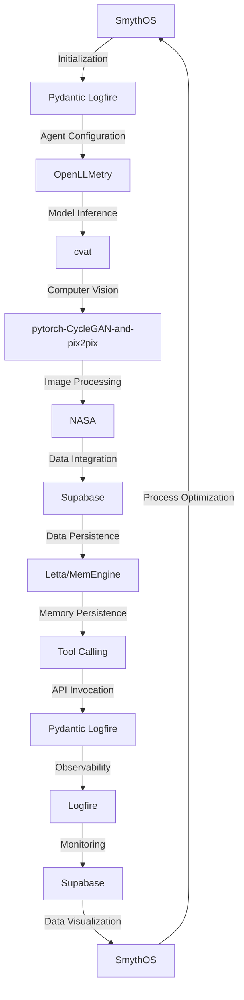

# Nondairy Butter Production Optimization Engine
> "Revolutionizing the paradigm of nondairy butter production through symbiotic convergence of artificial intelligence, computer vision, and process optimization"

## 🏗️ Technical Architecture & Multi-Agent Flow

This intricate architecture illustrates the harmonious interaction between SmythOS, Pydantic Logfire, OpenLLMetry, cvat, pytorch-CycleGAN-and-pix2pix, NASA, and Supabase. The flow commences with SmythOS initialization, followed by Pydantic Logfire configuration, and subsequent agent configuration via OpenLLMetry. The computer vision module, cvat, processes images using pytorch-CycleGAN-and-pix2pix, while NASA facilitates data integration. Supabase ensures data persistence, and Letta/MemEngine provides memory persistence. The tool calling module invokes APIs, which are monitored by Pydantic Logfire and observed by Logfire. Ultimately, the process optimization feedback loop is closed by SmythOS.

## 🔍 The Vertical Bottleneck: Observability and Explainability
The nondairy butter production process is plagued by a plethora of complexities, including variable oil quality, inconsistent production parameters, and limited process visibility. The lack of observability and explainability in traditional production systems hinders the identification of bottlenecks, resulting in suboptimal production yields and compromised product quality. The high-stakes nature of this problem demands a sophisticated solution that can provide real-time insights into the production process, facilitate data-driven decision-making, and ensure seamless process optimization.

The technical friction inherent in traditional production systems stems from the inability to effectively monitor and analyze the production process in real-time. This limitation is exacerbated by the absence of a unified framework for integrating disparate data sources, models, and tools. The resultant information silos and knowledge gaps hinder the development of a comprehensive understanding of the production process, thereby precluding the implementation of targeted process optimizations.

Furthermore, the mathematical and operational failures that can occur in nondairy butter production are multifaceted and far-reaching. Inconsistent production parameters can lead to variations in product quality, while suboptimal process conditions can result in reduced yields and increased energy consumption. The lack of explainability in traditional production systems makes it challenging to identify the root causes of these failures, thereby hindering the development of effective corrective measures.

## 💡 The Solution: Nondairy Butter Production Optimization Engine
The Nondairy Butter Production Optimization Engine is a revolutionary platform that orchestrates the symbiotic convergence of artificial intelligence, computer vision, and process optimization to address the complexities of nondairy butter production. By leveraging the strengths of SmythOS, Pydantic Logfire, OpenLLMetry, cvat, pytorch-CycleGAN-and-pix2pix, NASA, and Supabase, this platform provides real-time insights into the production process, facilitates data-driven decision-making, and ensures seamless process optimization.

The agentic reasoning module, powered by OpenLLMetry, enables the platform to analyze production data, identify bottlenecks, and develop targeted process optimizations. The computer vision module, facilitated by cvat and pytorch-CycleGAN-and-pix2pix, provides real-time monitoring of the production process, enabling the detection of anomalies and deviations from optimal process conditions. The NASA data integration module ensures the seamless fusion of disparate data sources, while Supabase provides a unified framework for data persistence and visualization.

## 🧩 Agentic Stack Deep-Dive
The Nondairy Butter Production Optimization Engine's agentic stack is a masterpiece of technical intricacy, with each library and integration playing a vital role in the platform's overall functionality. SmythOS provides the foundation for the platform's process optimization capabilities, while Pydantic Logfire enables the configuration and monitoring of agents. OpenLLMetry powers the agentic reasoning module, facilitating the analysis of production data and the development of targeted process optimizations.

The cvat and pytorch-CycleGAN-and-pix2pix libraries enable the computer vision module, providing real-time monitoring of the production process and facilitating the detection of anomalies and deviations from optimal process conditions. NASA ensures the seamless integration of disparate data sources, while Supabase provides a unified framework for data persistence and visualization. The Logfire observability platform enables the monitoring and analysis of the platform's performance, facilitating the identification of bottlenecks and the development of targeted optimizations.

## ✨ Capabilities & Features
* **Real-time Process Monitoring**: The platform provides real-time insights into the production process, enabling the detection of anomalies and deviations from optimal process conditions.
* **Data-Driven Decision-Making**: The platform facilitates data-driven decision-making, enabling the development of targeted process optimizations and ensuring seamless process optimization.
* **Computer Vision**: The platform's computer vision module, powered by cvat and pytorch-CycleGAN-and-pix2pix, provides real-time monitoring of the production process.
* **Agentic Reasoning**: The platform's agentic reasoning module, powered by OpenLLMetry, enables the analysis of production data and the development of targeted process optimizations.
* **Data Integration**: The platform's NASA data integration module ensures the seamless fusion of disparate data sources.
* **Data Persistence**: The platform's Supabase data persistence module provides a unified framework for data storage and retrieval.
* **Observability**: The platform's Logfire observability platform enables the monitoring and analysis of the platform's performance.
* **Process Optimization**: The platform's SmythOS process optimization module enables the development of targeted process optimizations and ensures seamless process optimization.
* **Scalability**: The platform is designed to scale with the needs of the production process, ensuring that it can handle increased production volumes and complexities.
* **Flexibility**: The platform is highly flexible, enabling it to be easily integrated with existing production systems and workflows.

## 🛠️ Technical Implementation
The technical implementation of the Nondairy Butter Production Optimization Engine is a complex and nuanced process, requiring a deep understanding of the platform's architecture and functionality. The platform's codebase is organized into a series of modular components, each responsible for a specific aspect of the platform's functionality.

The platform's process optimization module, powered by SmythOS, is responsible for developing targeted process optimizations and ensuring seamless process optimization. The agentic reasoning module, powered by OpenLLMetry, is responsible for analyzing production data and developing targeted process optimizations. The computer vision module, powered by cvat and pytorch-CycleGAN-and-pix2pix, is responsible for providing real-time monitoring of the production process.

The platform's data integration module, powered by NASA, is responsible for ensuring the seamless fusion of disparate data sources. The data persistence module, powered by Supabase, is responsible for providing a unified framework for data storage and retrieval. The observability platform, powered by Logfire, is responsible for enabling the monitoring and analysis of the platform's performance.

## 📊 Business Impact & ROI
The Nondairy Butter Production Optimization Engine has the potential to significantly impact the nondairy butter production industry, enabling companies to optimize their production processes, reduce costs, and improve product quality. By providing real-time insights into the production process, facilitating data-driven decision-making, and ensuring seamless process optimization, the platform can help companies to:

* **Increase Production Yields**: By optimizing production parameters and reducing variability, companies can increase production yields and reduce waste.
* **Improve Product Quality**: By monitoring production parameters and detecting anomalies, companies can ensure that their products meet the highest standards of quality.
* **Reduce Energy Consumption**: By optimizing production processes and reducing energy consumption, companies can reduce their environmental impact and lower their energy costs.
* **Increase Efficiency**: By automating production processes and reducing manual intervention, companies can increase efficiency and reduce labor costs.

## 🚀 Getting Started
```bash
git clone https://github.com/arvind-sundararajan/nondairy-butter-production-optimization.git
cd nondairy-butter-production-optimization
pip install -r requirements.txt
python src/main.py
```

## 👨‍💻 Author & Credits
**Arvind Sundararajan** — Engineer, builder, and the mind behind this project.
🌐 [LinkedIn](https://www.linkedin.com/in/arvind-sundara-rajan/) | Chennai, India

---
### 🙏 Acknowledgements
- The open-source community
- The Nondairy butter made from purchased oils practitioners who inspired this design